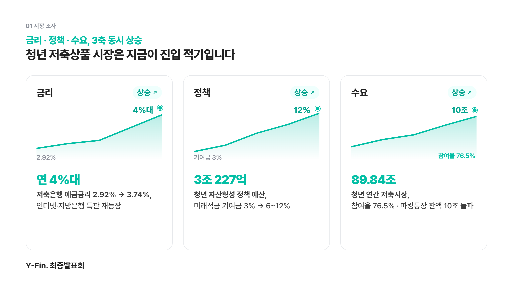
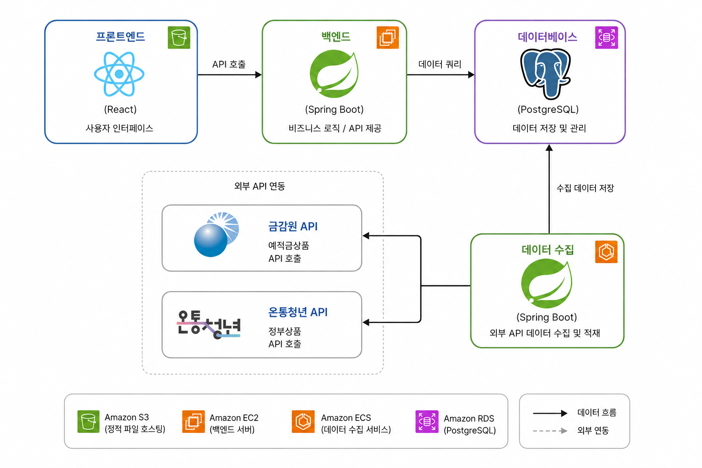
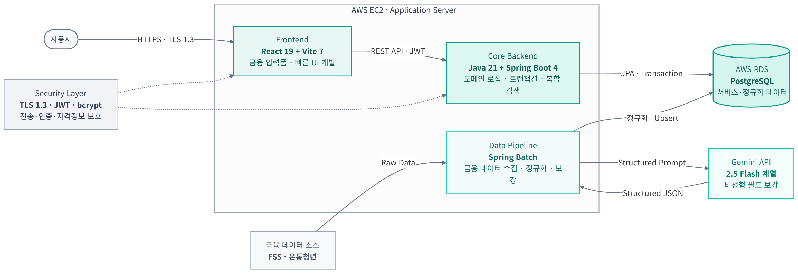
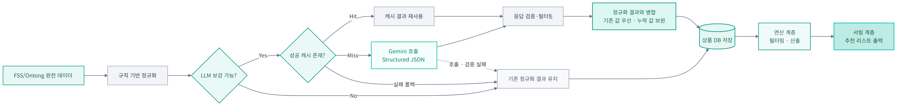
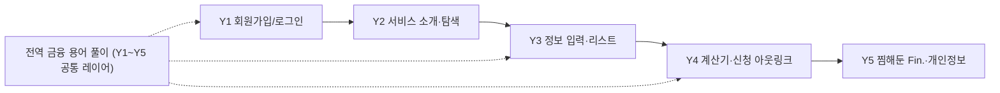
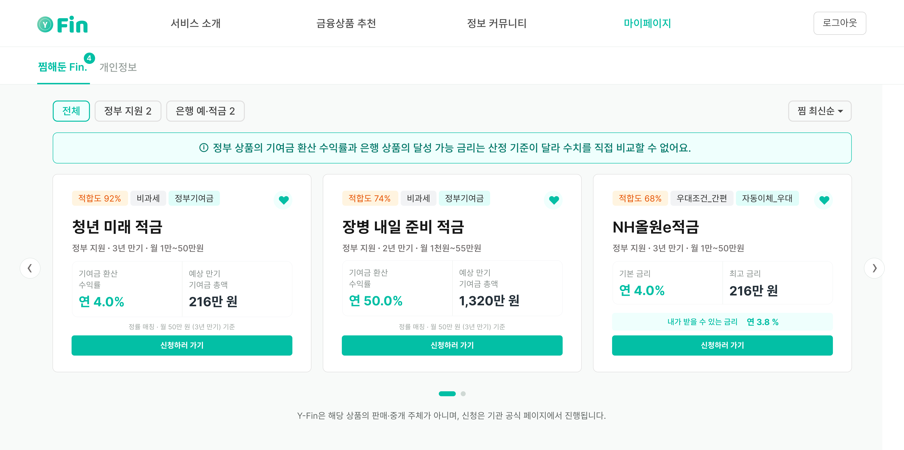
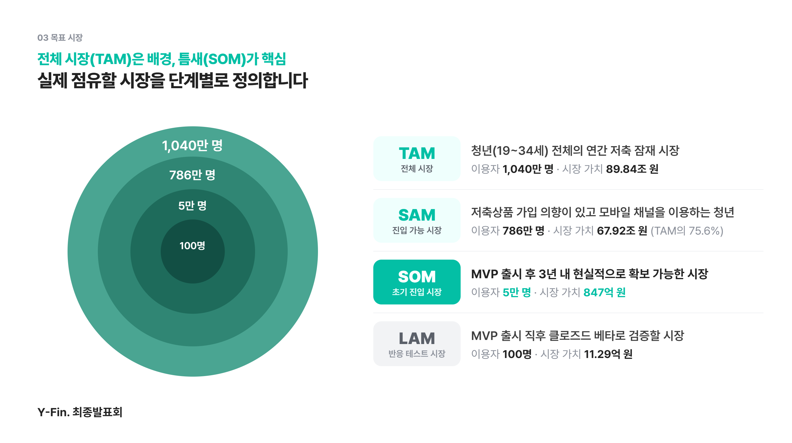
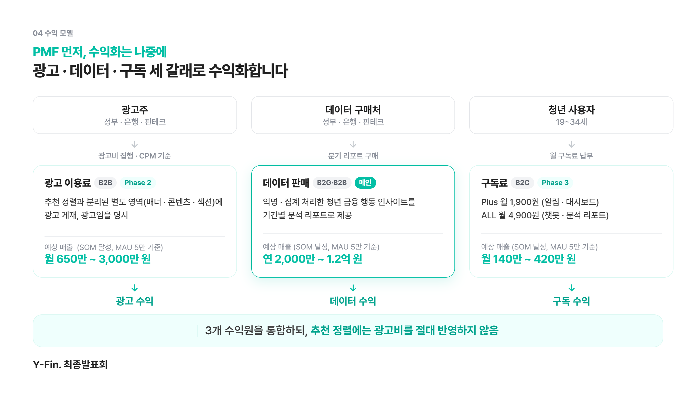

<div align="center">

# Y-Fin.

**청년(Youth)들의 금융(Finance) 고민을 끝(Finish)내다**

금융초보 청년을 위한 개인 맞춤 저축상품 추천 서비스


</div>

> Y-Fin.은 흩어져 있는 정부·은행 저축상품을 한곳에 모으고, **자격요건 자동 필터링**과 **적합도 및 세후 실수령액 정렬**로 청년이 자신에게 맞는 상품을 찾아 신청까지 이어가도록 돕는 서비스임.
>
> **개발 성과 - P0 핵심 기능(Y1~Y5) 전체 개발 완료, 내부 QA 완료, 실서비스 배포 완료** 

기획서에 머문 아이디어가 아니라 지금 동작하는 서비스로 증명함.

---

## 목차

1. [프로젝트 소개](#1-프로젝트-소개)
2. [상세설계](#2-상세설계)
3. [개발결과](#3-개발결과)
4. [설치 및 사용 방법](#4-설치-및-사용-방법)
5. [소개 및 시연영상](#5-소개-및-시연영상)
6. [사업화 및 향후 계획](#6-사업화-및-향후-계획)
7. [팀 소개](#7-팀-소개)
8. [해커톤 참여 후기](#8-해커톤-참여-후기)

---

## 1. 프로젝트 소개

### 1.1. 개발 배경 및 필요성

청년에게 저축은 습관이 아니라 **선택의 문제**임. 같은 돈을 넣어도 어떤 상품을 고르느냐에 따라 결과가 크게 갈리기 때문임. 실제로 월 50만 원을 3년간 납입할 때, 청년미래적금의 정부 기여금은 **최대 216만 원**에 달하고, 같은 적금이라도 금리 차이에 따라 이자가 연 약 10만 원 벌어짐. 상품 하나를 제대로 고르면 **3년간 200만 원 이상**을 더 받는 것임.

그리고 지금은 그 선택의 가치가 가장 큰 시점임. **금리·정책·수요 세 축이 동시에 오르며** 저축상품 시장이 구조적인 진입 적기에 들어섰기 때문임.

<p align="center">
  <br>
  <sub>▲ 금리·정책·수요 3축 동시 상승 (한국은행·금융위·서민금융진흥원 2024~2026)</sub>
</p>

| 축 | 현황 | 출처 |
| --- | --- | --- |
| 금리 | 기준금리 2.5% 동결(2026.4)에도 저축은행 평균 예금금리가 2.92% → **3.74%** 로 오르고, 인터넷·지방은행에서 **연 4%대**(최고 4.3~4.35%) 특판이 재등장 | 한국은행, 한국경제 2026.6 |
| 정책 | 정부가 2026년 청년 자산형성 지원에 6개 부처 사업으로 **3조 227억 원**을 편성하고, 기여금 6~12%·만기 3년의 청년미래적금을 신설 | 정책브리핑 2026, 금융위 |
| 수요 | 청년 저축·투자 참여율이 **76.5%**, 월 평균 저축액이 94.1만 원이며, **청년 10명 중 8명(84%)**이 적금에 가입 중 | 서민금융진흥원 『2024 청년금융 실태조사』(2025.3) |

이 세 축을 종합하면 청년 연간 저축시장은 약 **89.84조 원** 규모임(청년 인구 1,040만 × 참여율 76.5% × 월 94.1만 × 12개월)

정책적인 수요도 실측되었는데, 2026.6.22 출시된 청년미래적금에는 **신청 234만·가입 138.5만 명**이 몰렸고, 갈 곳을 찾지 못한 단기 자금은 저축은행 파킹통장으로 몰려 2024년 말 잔액이 **10조 62억 원**을 넘어섬(79개 은행 합산, 토스뱅크)

문제는 기회가 커진 만큼 선택이 어려워졌다는 점임. 청년이 가입할 수 있는 저축상품은 **398개 이상**으로 늘었고, Y-Fin.은 이 중 정부 63개와 은행 328개를 합쳐 **391개를 정규화 완료**한 상태임.

> 결국 지금 부족한 것은 저축상품이 아니라, 398개 중 **내가 실제로 받을 수 있는 것을 가려내 보여주는 비교 도구**임. Y-Fin.이 존재해야 하는 이유가 여기에 있음.

### 1.2. 문제 정의

상품이 늘어난 만큼, 청년의 상품 가입을 가로막는 장벽도 뚜렷해짐. Y-Fin. 팀은 시장조사를 통해 3개의 문제를 가설로 세우고, **19~34세 청년 61명**을 대상으로 1차 설문조사(2026.04, 14문항)를 실시해 이를 검증함. 그 결과 3문제 모두 현재 청년들이 실제로 겪고있는 문제로 확인됨.

<p align="center">
  <br>
  <sub>▲ 1차 설문조사 탐색 단계 상위 3개 페인포인트 (n=61, 2026.04)</sub>
</p>

| 문제점 | 설문 응답률 | 내용 |
| --- | :---: | --- |
| ① 정보 과부하·분산 | **75%** | 정부·은행 상품이 채널마다 흩어져 있고, 토스·카카오페이조차 통합해 보여주지 않음. 정보를 얻는 경로도 가족·커뮤니티 등으로 분산됨 |
| ② 우대금리 불투명 | **48%** | 광고하는 최고금리와 실제 달성 금리가 평균 1~3%p 차이 남. 우대조건을 모두 충족해야만 최고금리가 적용됨 |
| ③ 금융 용어 장벽 | **57%** | 20대 금융이해력이 70대와 함께 최하위권이며(2024 전국민 금융이해력 조사), 상품 약관 완독률은 5%에 그침 |

이 문제점들은 곧바로 이탈로 이어짐. 청년의 **64%가 비교만 하다 신청 전에 포기**하고, 가입한 뒤에도 **26%가 상품을 중도에 해지**함(설문 이탈률 응답, 청년도약계좌 중도해지율 2026.5 기준). 개선이 가장 필요한 단계로도 비교(46%)와 탐색(33%)이 꼽혀, **79%의 청년이 탐색-비교 구간의 병목**을 지목함.

> **핵심 문제 정의** - 저축상품을 처음 가입하거나 갈아타려는 청년은, 정보 과부하·우대금리 불투명·용어 장벽 때문에 비교에 많은 시간을 쓰고도 받을 수 있는 이자와 정부 기여금을 놓친 채 이탈함. **탐색-비교 단계의 정보 비효율이 실제 가입 전환의 가장 큰 병목**임.

### 1.3. 핵심 목표 및 주요 내용

Y-Fin.의 핵심 목표는 청년의 저축상품 탐색-비교 과정을 자격요건 필터링과 개인 맞춤 정렬로 간편하게 만들고, **실제 가입 신청까지 이어주는 것**임. 이를 위해 먼저 상단 대분류에서 저축 목적을 나눠, 목적에 맞는 상품군만 비교하도록 설계함.

| 대분류 | 포함 상품 |
| --- | --- |
| 단기예치 | 파킹통장 · 초단기 예적금 |
| 목돈만들기 | 예적금 · 정책저축 |
| 내집마련 | 주택청약 · 주거정책 |

각 기능은 앞서 정의한 문제와 설문으로 검증된 요구에 1:1로 대응함. 추측이 아니라 **청년의 응답 데이터에서 기능을 도출**했음.

| 검증된 요구 (설문) | 대응 기능 |
| --- | --- |
| 수익률 계산기 필요 **97%** (Q8, 전 기능 유용성 1위) | 세후 실수령액 수익률 계산기 |
| 키워드 기반 탐색 유용 **95%** (Q4) | 정보 입력 1단계: 키워드 선택 |
| 비교 시 금리 84%·세후 실수령액 51% 중시 (Q5) | 세후 실수령액 순 정렬 |
| 아웃링크 연동 유용 **89%** (Q11) | 공식 채널 신청 아웃링크 |
| 용어 이해 어려움 57%·약관 미독 43% (Q6) | 서비스 전역 금융 용어 풀이 |

### 1.4. 세부 내용 - 3단계 추천 로직

Y-Fin.의 추천은 상품을 **모으고·거르고·정렬하는 단 3단계**로 작동함. 복잡한 탐색 과정을 3단계 추천 로직으로 압축해, 금융상품에 대해 잘 모르는 청년도 자기에게 맞는 순서로 상품을 확인할 수 있음.

<p align="center">
  <br>
  <sub>▲ 정보 입력 - 자격요건 필터링 - 세후 실수령액 정렬의 3단계 로직</sub>
</p>

1. **정보 입력** - 키워드를 선택해 선호를 반영하고, 수동 입력으로 자격 요건을 받음. 이때 동적 폼이 불필요한 질문을 스스로 걷어냄(예: #미취업을 고르면 근속 기간 항목이 자동으로 사라짐)
2. **자격요건 자동 필터링** - 입력값을 상품별 자격 룰과 대조해 가입 불가 상품을 자동 제외하고, **총 OO개 중 자격 미충족 XX개 제외**로 필터가 작동한 근거를 투명하게 보여줌
3. **정렬** - 광고 최고금리가 아니라 **적합도**와 **세후 실수령액**을 기준으로 구성하여 남은 상품을 줄 세움

정렬된 추천 결과는 대분류를 선택하여 탭으로 볼 수 있음. 목돈만들기는 탭 A(적합도 순)와 탭 B(세후 실수령액 순)로, 단기예치는 탭 C(초단기 예적금 실수령액 순)와 탭 D(파킹통장 최고금리 순)로 비교함. 이 정렬을 뒷받침하는 두 가지 기준은 다음과 같음.

- **적합도** - 유저가 선택한 키워드와 상품 속성을 매칭해 100점 만점으로 산출함. 배점은 상품 데이터 특성을 반영한 고정 배점(고특성 30점·일반 20점)이며, 구조가 다른 정부·은행 상품은 배점 체계를 분리해 각각 계산함.
- **세후 실수령액** - 내가 받을 수 있는 금리만으로는 비교가 왜곡됨. 정부 상품은 금리가 공시되지 않고, 은행은 광고 최고금리와 실제 금리가 1~3%p 차이 나며, **같은 금리라도 예금이 적금보다 실수령이 약 1.8배** 크기 때문임. Y-Fin.은 정부 기여금을 연환산 수익률로 변환하고, 은행은 기본금리에 실제 충족 가능한 우대금리만 더한 세후 실수령액으로 모든 상품을 같은 선상에서 비교함.

### 1.5. 기존 서비스 대비 차별성

기존 서비스는 두 축 중 하나만 채움. 공공 서비스는 상품 범위는 넓으나 개인화가 부재하고, 핀테크 서비스는 개인화는 일부 지원하나 정책상품 커버리지가 부족함. 은행 서비스들은 자행 상품 추천에 편향되어 있음. Y-Fin.은 **정부·은행 통합 + 청년 맞춤 추천이라는, 어떤 경쟁사도 서 있지 않은 화이트 스페이스**에 위치함.

<p align="center">
  <br>
  <sub>▲ 포지셔닝 맵과 경쟁사 기능별 비교 (O 제공 · △ 부분 · X 미제공)</sub>
</p>

특히 **적합도 순 정렬과 세후 실수령액 순 정렬은 어떤 경쟁사도 제공하지 않는 Y-Fin.만의 고유 기능**임. 

대형 플랫폼의 후속 진입에도 경쟁우위가 지속되는 이유는 크게 두 가지임. 첫째, 추천 로직의 청년 자격 판정 정밀도가 높아지고 데이터가 쌓일수록 **청년을 타겟으로 한 추천이 정확해지는 선순환 구조**가 형성됨. 둘째, 저축 상품은 중개 수수료가 낮아 빅테크 기업에게는 후순위 시장이라, **본격적으로 진입할 인센티브가 구조적으로 약함**.

### 1.6. 사회적 가치 도입 계획

Y-Fin.은 금융위 2026 정책 기조 「생산적·포용·신뢰받는 금융」과 직접 연계됨.

- **정책 효과성 제고** - 청년들이 자격을 몰라서 놓치는 정부 사업의 실제 가입률을 높임. 청년미래적금은 예산 대비 약 **86만 명분이 미신청** 상태로, 정책은 있으나 대상 청년에게 도달하지 못하고 있음. Y-Fin.이 이러한 발견과 신청 격차를 좁힘.
- **포용금융 실현** - 금융 정보 비대칭을 용어 풀이로 완화하고, 광고금리가 아닌 **세후 실수령액을 표시해 다크패턴에 따른 금리 오인 가입을 차단**함. 영남권 청년 우선 접근으로 지역 격차에도 대응함.
- **신뢰 보호·중립** - 추천 정렬에 광고비를 반영하지 않고, 광고는 별도 영역으로 격리·명시함. 판매·중개가 아닌 정보 제공 서비스로서 신청은 공식 채널 아웃링크로 연결함.

---

## 2. 상세설계

### 2.1. 시스템 구성도

AWS EC2 위에 Frontend·Core Backend·Data Pipeline을 올리고, RDS(PostgreSQL)를 공용 저장소로 사용함. 전 구간은 **Security Layer**(TLS 1.3·JWT·bcrypt)로 보호함.

<p align="center">
  <br>
  <sub>▲ 프론트엔드 - 백엔드 - 데이터베이스 - 데이터 수집기 - 공공 API 구성</sub>
</p>


데이터는 **공공 API → 정기 수집·정제(Spring Batch) → DB 적재 → 필터링·계산 → 맞춤 추천**의 5단계로 흐름. 수집·가공·서빙 계층을 분리했기에, 대출이나 마이데이터 2.0 API가 추가돼도 **기존 구조를 훼손하지 않고 확장**할 수 있음.

<p align="center">
  <br>
  <sub>▲ 수집 - 정제 - 적재 - 연산 - 서빙 5단계 데이터 파이프라인</sub>
</p>

### 2.2. 사용 기술

| 구분 | 스택 | 선정 근거 |
| --- | --- | --- |
| Frontend (Fin-FE) | JavaScript, React 19.2 + Vite 7.3, Tailwind 4, framer-motion, axios | 복잡한 금융 입력폼 상태 관리 |
| Backend (Fin-BE) | Java 21, Spring Boot 4.0.3, Spring Data JPA·Security·Validation, JWT·bcrypt | 도메인 로직 분리·트랜잭션·복합 조건 검색 |
| Collector (Fin-API) | Spring Boot 4, Spring Batch, 금감원·온통청년 API, Gemini 2.5 Flash-Lite | 공공 데이터 정기 수집·정규화 |
| Infra / DB | AWS EC2 + RDS, PostgreSQL 16 + pgvector, Docker Compose, Sentry·GA4 | 애플리케이션/DB 분리 운영·모니터링 |
| 보안 | HTTPS/TLS 1.3, JWT, bcrypt | 금융 서비스 신뢰도 확보 |

### 2.3. 활용 생성형 AI (제품 내장)

> 전체 문서는 [`docs/ai-usage.md`](./docs/ai-usage.md) 참고

#### 활용 도구와 범위

| 구분 | 도구 | 활용 범위 |
|---|---|---|
| 서비스 핵심 기능 | **Gemini API 2.5 Flash-Lite** | FSS 상품 원문의 비정형 조건을 비교·추천용 데이터로 구조화 |
| 개발 지원 | **Claude Code** | 요구사항·설계, 백엔드·수집기·프론트 구현, 테스트·디버깅 |
| 개발 지원 | **Codex** | 배포, 코드 리뷰, 오류 분석, 문서 점검 |

AI가 결과를 단독으로 결정하지 않도록, **제품에서는 규칙과 검증 코드로 LLM을 통제하고 개발에서는 팀원이 검토·테스트한 뒤 반영**함.

#### 핵심 성과 - LLM을 결합한 금융상품 데이터 수집

금감원 API의 가입대상·우대조건은 은행마다 자연어 표현이 달라 단순 규칙만으로는 동일하게 비교하기 어려움. 이를 해결하기 위해 `api/` Spring Batch 수집기에 **규칙 기반 + LLM 하이브리드 정규화**를 구현함.

<p align="center">
  <br>
  <sub>▲ 규칙 기반 + LLM 하이브리드 정규화 흐름</sub>
</p>

1. **원문 보존** - API 응답을 `ProductRaw`에 저장해 원문 대조와 재처리를 가능하게 함
2. **1차 정규화** - 코드가 상품명·은행·기본/최고금리·기간 등 명확한 값을 먼저 추출함
3. **LLM 보강** - 원문과 1차 결과에서 요약, 연령·소득·월 납입 조건, 가입 필수/제외 조건, 조건별 우대금리를 Structured JSON으로 추출함. 기본/최고금리·기간·상품코드·은행·URL은 LLM 생성 대상에서 제외함
4. **검증·병합** - 규칙값을 우선하고 원문 근거와 `HIGH` 신뢰도를 만족한 값만 보수적으로 반영함
5. **저장** - 검증된 보강값 또는 실패 시의 규칙 결과를 공통 스키마에 저장해 정부·은행 상품을 같은 기준으로 추천함

신뢰성은 `temperature=0`, 동시 요청 수를 제한한 비동기 배치, 원문·모델·프롬프트·스키마 버전 기반 캐시로 확보함. `NORMALIZE_ONLY` 모드에서는 외부 API 재호출 없이 저장된 원문을 재정규화함.

#### LLM 응답 검증·실패 대응

- **형식·값 검증** - JSON Schema로 응답 구조와 enum을 제한하고, 연령(`0~100`)·금리(`0~100%`)·음수 금액·최소·최대 역전·키워드 조합을 검사함
- **원문 근거 검증** - 소득 문구가 있을 때만 소득 상한을 수용하고, 예금의 월 납입한도와 근거 없는 자격 키워드 등 실제 오분류를 병합 가드로 제거함
- **폴백·관측** - 호출·파싱·검증 실패 시 규칙 결과를 유지함. 실패는 6시간 재호출하지 않고 캐시 적중·호출·실패·쿨다운 수를 로그로 집계함
- **회귀 테스트** - 프롬프트·스키마·파서·검증·캐시·폴백·병합을 다루는 **45개 단위 테스트**로 오분류·캐시 불일치·API 실패를 재현함

---

## 3. 개발결과

> **MVP P0 전 기능(Y1~Y5)을 개발 완료하고, 내부 QA를 마친 뒤 실서비스로 배포했음.** 아래 화면들은 전부 실제 동작 중인 기능임.

### 3.1. 전체 시스템 흐름도

서비스는 회원가입에서 추천, 상세, 마이페이지까지 하나의 플로우로 이어짐. 전역 금융 용어 풀이는 특정 단계가 아니라 **모든 화면을 가로지르는 공통 레이어**로 동작함.



### 3.2. 기능 설명

| 기능 | 핵심 구현 내용 | 현황 |
| --- | --- | :---: |
| Y1 회원가입/로그인 | SNS OAuth 2.0 3초 가입, JWT 세션·자동 로그인, 최소 약관 동의 | ✅ |
| Y2 서비스 소개·탐색 | 스크롤 랜딩, 비로그인 권한 분기 모달 | ✅ |
| Y3-1 정보 입력 | 키워드 + 수동 입력, 동적 폼(미취업 시 근속 항목 숨김) | ✅ |
| Y3-2 리스트 | 자격요건 Hard Filter, 제외 수 노출, 탭 A·B 정렬 | ✅ |
| Y4-1 수익률 계산기 | 세전·세후 실수령액 시뮬레이션, 과세/비과세 분기 | ✅ |
| Y4-2 신청 아웃링크 | 외부 신청 페이지 직결, 서류 안내 모달, GA4 트래킹 | ✅ |
| Y5 찜해둔 Fin.·개인정보 | 관심 상품 저장·비교·만기 알림, 재추천 프리필 | ✅ |
| 전역 금융 용어 풀이 | Y1~Y5 공통 레이어, 어려운 용어를 쉬운 말로 풀이(필요 시 LLM) | ✅ |

데이터는 은행(FSS) 328건과 정부(온통청년) 63건을 합쳐 **391건을 정규화 완료**함. 아래는 실제 동작 화면임.

<table>
<tr>
<td width="50%"><br><sub><b>Y1 회원가입·로그인</b> - 카카오·구글 OAuth로 3초 만에 가입</sub></td>
<td width="50%"><br><sub><b>Y1 약관 동의</b> - 추천에 필요한 최소 항목만 동의받음</sub></td>
</tr>
<tr>
<td width="50%"><br><sub><b>Y3-1 정보 입력 ①</b> - 목표·금액·기간·조건을 키워드로 선택</sub></td>
<td width="50%"><br><sub><b>Y3-1 정보 입력 ②</b> - 자격 요건 수동 입력, 동적 폼이 불필요한 질문을 숨김</sub></td>
</tr>
<tr>
<td width="50%"><br><sub><b>Y3-2 리스트 ①</b> - 최상단에 뜨는 TOP3 카드</sub></td>
<td width="50%"><br><sub><b>Y3-2 리스트 ②</b> - 아래로 스크롤하면 뜨는 리스트 카드</sub></td>
</tr>
<tr>
<td width="50%"><br><sub><b>Y4 상세 (정부상품)</b> - 기여금 환산 수익률과 자격조건 표시</sub></td>
<td width="50%"><br><sub><b>Y4 상세 (은행상품)</b> - 기본·최고·내가 받을 수 있는 금리와 우대조건 표시</sub></td>
</tr>
<tr>
<td width="50%"><br><sub><b>Y4-1 수익률 계산기 (예금)</b> - 거치식 세후 실수령액 자동 계산</sub></td>
<td width="50%"><br><sub><b>Y4-1 수익률 계산기 (적금)</b> - 적립식 세후 실수령액 계산</sub></td>
</tr>
<tr>
<td width="50%"><br><sub><b>Y5 찜해둔 Fin.</b> - 관심 상품 저장·비교 뷰</sub></td>
<td width="50%"><br><sub><b>Y5 개인정보 수정</b> - 저장된 정보로 입력 없이 다시 추천</sub></td>
</tr>
</table>

### 3.3. 기능 명세 (핵심 로직·검증)

- **자격요건 필터링(Hard Filter)** - 수동 입력값을 상품 자격 룰과 대조해 가입 불가 상품을 제외하고, 제외 근거를 문구로 노출함(**목표 오판정률 0%**)
- **탭 A 적합도** - 정부·은행 배점을 분리해 100점 만점으로 산출함(상품 데이터 특성 기반 고정 배점, 고특성 30·일반 20)
- **탭 B 세후 실수령액** - 정부 기여금을 연환산 수익률로, 은행은 기본금리에 충족 가능한 우대금리를 더해 세후 실수령액을 산출함
- **수익률 계산기** - 세전·세후 실수령액을 단리/복리·과세/비과세로 분기해 계산함
- **4계층 검증** - 자격 필터(오판정률 0% 목표), 적합도 점수, 달성 가능 금리(금감원 공시값 오차 0 목표), 용어 풀이(LLM 환각 검출)를 단계별로 검증함

### 3.4. 디렉토리 구조

```
pnuai-c-07-finfin2/
├── frontend/   # Fin-FE : React + Vite 웹 클라이언트
├── backend/    # Fin-BE : Spring Boot API 서버 (auth·user·search·calculator·myfin·category·provider)
├── api/        # Fin-API : Spring Batch 수집기 (batch·client·normalize·llm·product·raw)
└── docs/       # 보고서·ai-usage.md
```

### 3.5. AI 도구 활용 (개발 보조)

전 개발 단계에서 AI 코딩 도구를 **페어 프로그래밍 도구**로 활용함.

| 단계 | 주요 도구 | 활용 내용 |
|---|---|---|
| 기획 | Claude | 자격요건 필터·정렬 기준 설계, 수익률 계산 로직 검증 |
| 설계 | Claude | 아키텍처 설계, 시퀀스 다이어그램 구축 |
| 백엔드 | Codex / Claude | DTO·Entity·Repository 로직, 테스트 코드 작성 |
| 프론트 | Claude | 컴포넌트 개발, 반응형 UI 작업, UX 개선 |
| 데이터 | Codex / Claude | 공공 API 연동, 스키마 정규화 설정 |
| 배포·기타 | Codex | EC2·Docker Compose 스크립트 생성, 코드 리뷰 |

**생성 코드는 그대로 채택하지 않음.** 팀원이 요구사항과 기존 구조에 맞는지 diff를 리뷰하고 비즈니스 규칙·보안·예외 처리를 보완한 뒤, **단위·Testcontainers 통합 테스트를 통과한 코드만 반영**함. Git 이력에는 최초 LLM 보강 후 JSON 파싱·스키마·비동기 호출·캐시·폴백·오분류 가드·테스트를 반복 개선한 과정이 남아 있으며, 프로젝트 제약은 [`CLAUDE.md`](./CLAUDE.md)·[`AGENTS.md`](./AGENTS.md)로 공유함.

### 3.6. 개발 마일스톤 (26.02~08)

| 시기 | 내용 |
| --- | --- |
| 02 | 팀 결성 · PRD · 와이어프레임 |
| 03 | 시장조사 · API 연결 · Y1·Y2 완료 |
| 04~05 | 1차 설문 · Y3 완료 |
| 06~07 | Y4·Y5 완료 |
| 08 | **내부 QA 완료 · 실서비스 배포 완료 · SW 저작등록** |

### 3.7. 멘토링·피드백 반영

해커톤 예선과 여러 경진대회에서 받은 피드백을 개발에 반영함.

| 소스 | 피드백 | 반영 |
| --- | --- | --- |
| 이지스·팀미팅 | 시장 규모는 틈새 중심으로, 설문 신뢰도 보완 | SOM 중심 재설계, 표본 편향 명시 |
| 멘토·예선 | 독점기술 아님, 알고리즘 검증 필요 | 자격 판정 정밀도·4계층 검증·O/X 도표 |
| 샌드버그 CTO | 추천만으로는 리텐션에 한계 | 정부상품 캘린더·만기 알림 기획 |
| 중간보고회 | 실제 수치·저축시장 선택 이유 보강 | 미래적금 실증·딥리서치 반영 |

---

## 4. 설치 및 사용 방법

**요구 사항** - Node.js 22.x·pnpm 10.x, Java 21, Docker / Docker Compose, PostgreSQL 16(+pgvector, Docker Compose 자동 구동)

```bash
# Backend (Fin-BE)
cd backend && docker compose up -d && ./gradlew bootRun

# Collector (Fin-API) - 상품 데이터 수집
cd api && ./gradlew bootRun

# Frontend (Fin-FE)
cd frontend && pnpm install && pnpm dev
```

> 외부 API 키·DB 접속 정보 등 환경 변수는 각 모듈의 `.env` 예시를 참고함. 배포본은 https://fin-qa.yuyeol3.uk/ 에서 바로 확인할 수 있음.

---

## 5. 소개 및 시연영상

- 서비스 시연 영상: https://www.youtube.com/watch?v=Ujk2gfQ6XRs
  - 흐름 - 로그인 → 정보 입력 → 리스트 → 상세정보 → 수익률 계산기 → 마이페이지
- 배포 서비스: https://fin-qa.yuyeol3.uk/
- 프로젝트 배너(포스터): [docs/img/banner.png](docs/img/banner.png)

---

## 6. 사업화 및 향후 계획

### 6.1. 상품군 / 기능 확장

Y-Fin.은 저축상품 추천에서 멈추지 않고 **청년 금융 슈퍼앱**으로 나아감. 확장은 상품군과 기능 두 축으로 진행함.

- **상품군** - 단기예치(파킹통장·초단기 예적금, 개발 진행 중)에서 시작해, 주거 상품(주택청약·주거정책)으로 넓히고, 최종적으로 마이데이터를 연동해 입력 단계 없는 자동 맞춤 추천을 제공함
- **기능** - 가입 기간이 정해진 정부상품의 캘린더와 신청 일정 알림으로 재방문을 유도하고(기획 중), 청년 금융의 44.4%가 오가는 커뮤니티를 정확한 정보 위에서 다루는 뉴스·커뮤니티로 확장함(장기)

### 6.2. 목표 시장 (TAM-SAM-SOM)

전체 시장은 배경으로 두고, Y-Fin.이 실제로 점유할 **틈새(SOM)를 핵심 지표**로 제시함.

<p align="center">
  <br>
  <sub>▲ 전체 시장(TAM)에서 실제 점유할 시장(SOM)으로 좁혀가는 시장 규모</sub>
</p>

| 구분 | 규모 | 정의 |
| --- | --- | --- |
| TAM | 89.84조 원 / 1,040만 명 | 청년(19~34세) 전체의 연간 저축 잠재 시장 |
| SAM | 67.92조 원 / 786만 명 | 예적금 가입 의향이 있고 모바일 채널을 이용하는 청년 |
| **SOM** | **847억 원 / 5만 명** | MVP 출시 후 3년 내 확보 가능한 시장(신청 전환 기준) |
| LAM | 11.29억 원 / 100명 | 클로즈드 베타로 검증할 시장 |

> SOM 847억 원은 Y-Fin. 추천으로 신청까지 이어지는 **저축 유통 규모**이며, Y-Fin.의 매출이 아님(실매출은 6.4 수익 모델). 안착기 5천 명 단계의 저축 유통 규모는 약 84.7억 원임.

### 6.3. 시장 진입 로드맵

**PMF를 먼저 확보하고 수익화는 나중에 진행**함. 초기 수익화 압박이 추천 품질을 훼손하지 않도록 단계를 분리함.

<p align="center">
  <br>
  <sub>▲ PMF 우선, 수익화 후행의 3단계 시장 진입 로드맵</sub>
</p>

| 단계 | 기간 | 목표 | 핵심 활동 |
| --- | --- | --- | --- |
| PHASE 1 진입 | 26.06~09 | LAM · 베타 100명 | 상품군/기능 확장, 베타 테스트, MVP 출시, SW 저작등록 |
| PHASE 2 안착 | 26.10~27.06 | SOM 진입 · 누적 5천 명 | 본격 마케팅, 광고 BM 도입(B2B, 추천과 격리), MAU 1,000 |
| PHASE 3 확장 | 27.07~29.06 | SOM 달성 · 누적 5만 명 | 마이데이터 연동, 구독 BM(B2C), 데이터 BM(B2G·B2B), MAU 5,000 |

### 6.4. 수익 모델

**추천 정렬에 광고비를 반영하지 않는다는 원칙** 아래, 서비스가 안착한 뒤 광고·구독·데이터 순으로 수익화함. 판매·중개 수수료 모델은 금소법상 등록 의무가 발생해, 라이선스 취득 전까지 채택하지 않음. 아래 매출은 **SOM 달성(성숙기 MAU 5만) 기준 추정**임. 광고·구독 매출은 MAU에 정비례하며, 3년 진입기 지표는 6.5 KPI를 참고함.

<p align="center">
  <br>
  <sub>▲ 광고 · 데이터 · 구독 세 수익원과 Y-Fin.의 관계 (SOM 달성, MAU 5만 기준)</sub>
</p>

| 모델 | 유형 · 도입 | 내용 | 예상 매출 |
| --- | --- | --- | --- |
| **광고 (서브)** | B2B · Phase 2 | 추천과 분리된 별도 영역에 이미지 광고 게재, 광고임을 명시 | **월 약 650만~3,000만 원** (연 0.8억~3.7억) |
| **구독 (서브)** | B2C · Phase 3 | Plus(월 1,900원) · ALL(월 4,900원), 알림·챗봇·분석 리포트 | **월 약 140만~420만 원** (전환율 1~3%) |
| **데이터 (메인)** | B2G·B2B · Phase 3 | 익명·집계 청년 금융 행동 인사이트 리포트 제공 | **연 약 2,000만~1.2억 원** |

> 산정 근거 - 광고는 MAU 1명당 월 노출 약 21.6회 × 금융 버티컬 eCPM 6,000원(카카오페이·토스 실측 단가)에 MAU 5만을 적용함. 구독은 유료 전환율 1\~3%·가중 ARPU 2,800원, 데이터는 소비자 리포트 단가 1건 500만\~1,500만 원을 적용함. 세 수익원 합산 시 **연 약 1.7억~5.4억 원** 규모임.

### 6.5. 정량 목표 (KPI)

<p align="center">
  <br>
  <sub>▲ 다짐이 아닌 실제 수치로 검증할 핵심 지표</sub>
</p>

| 구분 | 지표 | 목표 | 측정 방법 |
| --- | --- | --- | --- |
| Primary | 정보 입력 완료율 | **80% 이상** | 퍼널 분석 |
| Secondary | 추천 상품 실제 신청률 | **15% 이상** | 아웃링크 클릭률 |
| Secondary | 회원가입 후 7일 리텐션 | 7% 이상 | 코호트 분석 |
| Secondary | 누적 MAU | 5,000명 (3년 내) | GA4 |
| Guardrail | API 오류율 | 1% 미만 | Sentry |

---

## 7. 팀 소개

> 핀핀이팀 (창업트랙 C-07)

| 구분 | 이름 | 역할 | 담당 |
| --- | --- | --- | --- |
| 팀장 | 이서빈 | 기획 | 서비스 기획·PRD·시장 분석·설문 설계 |
| 팀원 | 강지원 | Backend | User·Term·Category·Search 도메인(자격 필터·정렬 로직) |
| 팀원 | 최유렬 | Backend | Auth·Data 도메인(OAuth2·JWT·외부 API 전처리·저장) |
| 팀원 | 안지원 | Frontend | Fin-FE 화면 개발(React 19 + Vite) |
| 팀원 | 정예담 | Design | UX/UI 디자인 |

---

## 8. 해커톤 참여 후기

- **이서빈 (팀장·기획)** - 어떻게 AI를 서비스와 기능에 유의미하게 사용할 수 있을지 고민할 수 있는 해커톤이었습니다. 다양한 특강, 멘토링, 네트워킹에 참여하며, 초기 서비스를 AI 흐름에 발맞춰 고도화할 수 있었습니다.
- **강지원 (백엔드)** - AI를 활용하여 이전에는 오래 걸리거나 할 수 없었던 개발을 진행해볼 수 있어서 뜻 깊었고, 다양한 팀과 멘토님의 의견을 들어볼 수 있어서 좋았습니다.
- **최유렬 (백엔드)** - AI 해커톤이 제공하는 특강을 통해 프로젝트를 다양한 측면에서 고민해볼 수 있어 좋았고, 더 좋은 제품을 만들기 위해 LLM을 어떻게 사용할 수 있을지 고민하고 도입해본 경험이 유익했던 것 같습니다.
- **안지원 (프론트엔드)** - 잘 맞는 팀원들과 함께 AI를 활용해 아이디어를 구현해보는 과정이 즐거웠습니다. 멘토링을 통해 프로젝트에 대한 피드백을 받고 부족한 부분을 보완할 수 있어 유익했습니다.
- **정예담 (디자인)** - AI 해커톤을 통해 팀원들과 함께 프로젝트를 완성해 나가는 과정에서 팀워크의 중요성을 배울 수 있었습니다. 그리고 해커톤 프로그램을 통해 다양한 피드백을 받아보며 프로젝트를 발전시킬 수 있어 유익한 경험이었습니다.

---

<div align="center">
  <sub>PNU 2026 AI Hackathon · Startup Track · Team C-07 · Y-Fin.</sub>
</div>
