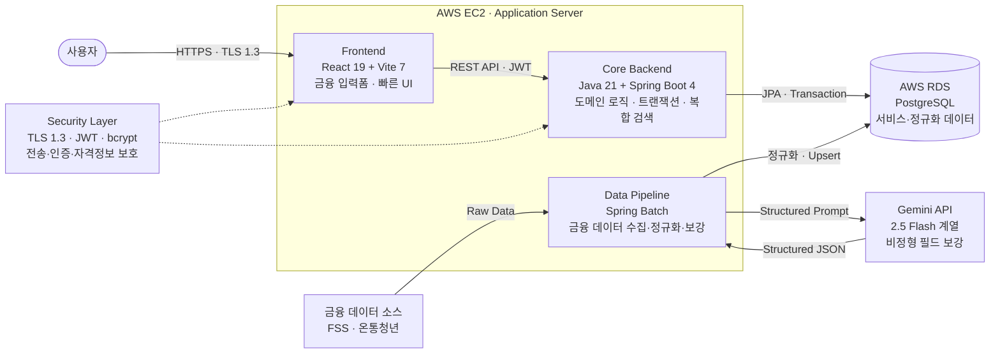
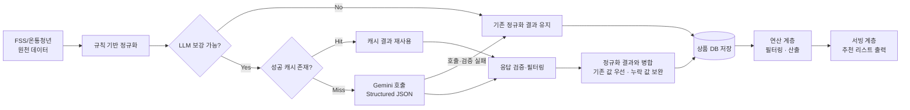

# Y-Fin. 

> **청년(Youth)들의 금융(Finance) 고민을 끝(Finish)내다**
>
> 19~34세 금융초보 청년을 위한 맞춤 예적금 추천 서비스

정부 정책 상품과 은행 상품을 한곳에 통합하고, 사용자 조건 기반 자격요건 자동 필터링과 "적합도 / 내가 받을 수 있는 금리" 순 정렬을 제공해 청년의 예적금 탐색-비교 과정을 간편하게 만드는 서비스입니다.

> **현재 상태:** P0 핵심 기능(Y1~Y5) 개발 완료, 내부 QA와 클로즈드 베타 테스트 진행 중. 상품군·기능 확장 준비 중

---

## 목차

1. [프로젝트 소개](#1-프로젝트-소개)
2. [상세설계](#2-상세설계)
3. [개발결과](#3-개발결과)
4. [설치 및 사용 방법](#4-설치-및-사용-방법)
5. [소개 및 시연 영상](#5-소개-및-시연-영상)
6. [팀 소개](#6-팀-소개)
7. [해커톤 참여 후기](#7-해커톤-참여-후기)

---

## 1. 프로젝트 소개

### 1.1. 개발배경 및 필요성

청년이 예적금을 제대로 고르면 **3년간 200만 원 이상의 차이**가 발생함. 이 차이는 저축 습관이 아니라 **상품 선택의 결과**임. 그리고 지금 그 선택을 좌우하는 세 축이 동시에 상승 중임.

| 축 | 현황 |
|---|---|
| **금리** | 기준금리 2.50% 동결에도 저축은행 평균 예금금리 2.92% → 3.74%, 특판·인터넷·지방은행 연 4%대 재등장(최고 4.15%) |
| **정책** | 6개 부처가 청년 자산형성 사업 운영, 2026년 예산 3조 227억 원. 청년미래적금 신설(기여금 매칭 3% → 6~12%로 2배 상향) |
| **수요** | 청년 저축·투자 참여율 76.5%, 월 평균 저축 94.1만 원. 미래적금 출시 4일 만에 신청 101만 명 돌파 |

선택지는 정부 63개 + 은행 328개 = **총 391개**로 역대 최대인데, 상승은 선택의 난이도를 함께 끌어올림.

- 광고 최고금리와 실제 달성 금리가 평균 1~3%p 다름
- 정책은 늘었지만 자격 판단이 어려움
- 그 결과 청년의 **64%가 비교 단계에서 이탈**, 미래적금 기여금 약 80만 명분이 미신청으로 잔존

> 지금 시장에 부족한 것은 상품이 아니라, **391개 중 "내가 받을 수 있는 것"을 가려내는 비교 도구**임. Y-Fin.의 진입 논거가 여기에 있음.

### 1.2. 개발 목표 및 주요 내용

세 가지 핵심 문제를 해결하는 것을 목표로 함. 각 문제는 자체 설문(61명)으로 검증됨.

| 핵심 문제 | 연계 핵심 기능 | 설문 검증 |
|---|---|---|
| 정보 과부하 / 분산 | 3단계 추천 로직, 정부·은행 상품 통합 리스트 | 탐색 어려움 75% (Q3) |
| 우대금리 불투명 | "내가 받을 수 있는 금리" 순 정렬, 수익률 계산기 | 수익률 계산기 필요 97% (Q8) |
| 금융 용어 이해 어려움 | 전역 금융 용어 풀이(필요 시 LLM 활용) | 용어 어려움 57%, 약관 미독 43% (Q6) |

- **핵심 문제 정의:** 예적금을 처음 가입하거나 갈아타려는 19~34세 청년은, 정보 과부하·우대금리 불투명·용어 장벽 때문에 비교에 수 시간을 쓰고도 연 최대 10만 원의 이자와 최대 216만 원의 정부 기여금을 놓친 채, 64%가 신청 전에 이탈하고 15-20%가 중도해지함

### 1.3. 세부내용 - 3단계 추천 로직

1. **정보 입력** - 키워드 선택(적합도) + 수동 입력(자격 요건)
2. **자격요건 자동 필터링** - 수동 입력 기준 가입 불가 상품 자동 제외, "총 OO개 중 자격 미충족 XX개 제외" 노출
3. **적합도 / 금리 순 정렬** - 탭 A(나에게 맞는 순) / 탭 B(내가 받을 수 있는 금리 순)

**탭 A 적합도:** 정부·은행 상품 배점을 분리해 100점 만점 산출. 가중치는 설문(Q12) 중요도 기반(월 납입 희망액 4.39·저축 기간 4.38·핵심 혜택 4.30 등)으로, 느낌이 아니라 청년 응답 데이터로 정렬함

**탭 B 달성 가능 금리:**
- 정부 상품 = 공시되지 않는 기여금을 **연환산 수익률로 변환하는 자체 산식**으로 은행 상품과 동일 선상 비교
- 은행 상품 = 기본금리 + 사용자가 **실제 충족 가능한 우대금리만** 합산 (광고 최고금리 X)

### 1.4. 기존 서비스 대비 차별성

| 핵심 기능 | **Y-Fin** | 온통청년·파인 | 토스·뱅크샐러드 | 핀다 | 은행 앱 |
|---|:---:|:---:|:---:|:---:|:---:|
| 정부 + 은행 상품 통합 | **O** | X | X | X | X |
| 자격요건 자동 필터링 | **O** | X | △ | △ | X |
| 적합도 순 정렬 | **O** | X | X | X | X |
| 달성 가능 금리순 정렬(정부상품 포함) | **O** | X | X | X | X |
| 전역 금융 용어 풀이 | **O** | X | △ | △ | X |
| 정렬에 광고비 미반영(중립) | **O** | O | X | X | X |

- **포지셔닝:** "정부·은행 통합 + 청년 맞춤 추천" 사분면은 어떤 경쟁사도 없는 화이트 스페이스
- **적합도 / 달성 가능 금리순 정렬은 Y-Fin.만의 고유 기능**이며, 통합·자동 필터링·용어 풀이·중립 비교를 완결성 있게 통합한 유일한 서비스

### 1.5. 사회적가치 도입 계획

- **정책 효과성 제고:** 청년미래적금 7,446억 예산도 청년이 자격을 모르면 효과 반감됨. Y-Fin.이 발견·이해·신청 경로를 단축해 정책 예산 대비 실제 가입률을 높임
- **포용금융 / ESG 연계:** 금융위 2026 기조「생산적·포용·신뢰받는 금융」과 직접 연계. 다크패턴 방지(달성 가능 금리 표시)와 지역 청년 금융격차 해소(영남권 우선)
- **신뢰 보호 원칙:** 추천 정렬에 광고비를 절대 반영하지 않고, 광고 수익은 별도 영역으로 격리·명시

---

## 2. 상세설계

### 2.1. 시스템 구성도

AWS EC2 위에 Frontend·Core Backend·Data Pipeline을 올리고, AWS RDS(PostgreSQL)를 공용 저장소로 사용함. 전 구간을 Security Layer(TLS 1.3·JWT·bcrypt)로 보호함



**5단계 데이터 파이프라인:** 외부 공공 API → 정기 수집·정제(Spring Batch) → DB 적재(정규화 스키마) → API 서버 처리(필터링·계산) → 사용자 맞춤 추천 결과. 수집·가공·서빙 계층을 분리해 신규 API 추가나 마이데이터 2.0 연동 시에도 구조 훼손 없이 확장 가능함

**LLM 보강 정규화 흐름:** 규칙 기반 정규화를 먼저 적용하고, 보강이 필요한 비정형 필드만 Gemini를 호출함. 캐시·폴백을 두어 LLM 실패 시에도 기존 정규화 결과를 유지함



### 2.2. 사용 기술

**Frontend (Fin-FE)**

| 구분 | 기술 |
|---|---|
| 언어·런타임 | JavaScript, Node.js 22.x, pnpm 10.x |
| 프레임워크 | React 19.2, React Router DOM 7.13 |
| 빌드 | Vite 7.3, React Compiler |
| 스타일 | Tailwind CSS 4.2, styled-components 6.3 |
| 기타 | framer-motion 12.38(인터랙션), axios 1.13(HTTP), ESLint 9 |

**Backend (Fin-BE) - API 서버**

| 구분 | 기술 |
|---|---|
| 언어·런타임 | Java 21, Gradle |
| 프레임워크 | Spring Boot 4.0.3, Spring Web / Data JPA / Security / Validation |
| 인증·보안 | Spring OAuth2 Client, JWT(jjwt 0.12.x), bcrypt, TLS 1.3 |
| 문서화 | springdoc-openapi 2.8(Swagger UI) |
| 캐시·테스트 | Spring Cache, Testcontainers(PostgreSQL) |

**Collector (Fin-API) - 데이터 수집 서버**

| 구분 | 기술 |
|---|---|
| 프레임워크 | Spring Boot 4.x, Spring Batch(정기 배치 Job) |
| 외부 연동 | 금감원 금융상품한눈에 API, 온통청년 API |
| 정규화 | Gemini API(2.5 Flash-Lite) 기반 데이터 정규화·보강 |

**Infra / DB**

| 구분 | 기술 |
|---|---|
| 인프라 | AWS EC2(Application Server), AWS RDS(PostgreSQL) |
| DB | PostgreSQL 16 + pgvector |
| 로컬 개발 | Docker Compose |
| 모니터링 | Sentry(API 오류율), GA4(퍼널 분석) |

### 2.3. 활용 생성형 AI / AI 코딩 도구

- **Gemini API(2.5 Flash-Lite)** - 규칙 기반으로 정규화되지 않는 비정형 필드만 선별해 보강, 전역 금융 용어 풀이에 활용. Structured JSON 응답 검증·캐싱과 프롬프트 버전 관리(`llm.prompt-version`)로 로직 변경 시 재처리 제어
- **AI 코딩 도구(Claude · Codex)** - 기획·설계·백엔드·프론트엔드·데이터 전 단계에 활용. 레포 내 `CLAUDE.md` / `AGENTS.md`로 협업 규칙을 명문화해 아키텍처 일관성을 유지하며 개발을 가속함

---

## 3. 개발결과

### 3.1. 전체 시스템 흐름도 (P0 기능 플로우)

```
Y1 회원가입/로그인 → Y2 서비스 소개·탐색 → Y3 정보 입력·리스트
   → Y4 수익률 계산기·신청 아웃링크 → Y5 찜해둔 Fin.·개인정보 수정
```

전역 금융 용어 풀이는 특정 단계가 아니라 Y1~Y5 전 화면을 가로지르는 공통 UX 레이어임

### 3.2. 기능설명

> **진행 현황:** P0 기능(Y1~Y5) **전체 개발 완료**. 현재 **내부 QA와 클로즈드 베타 테스트**를 병행 중이며, 단순 기획서가 아니라 **동작하는 결과물**로 증명함

| 기능 | 핵심 구현 내용 | 현황 |
|---|---|:---:|
| **Y1 회원가입/로그인** | SNS OAuth 2.0 간편 로그인, JWT 세션·자동 로그인, 최소 약관 동의 | ✅ 완료 |
| **Y2-1 서비스 소개** | 스크롤 기반 랜딩 페이지 렌더링, 인터랙션 연출 | ✅ 완료 |
| **Y2-2 서비스 탐색** | 비로그인 권한 분기, 제한 기능 클릭 시 모달 UX | ✅ 완료 |
| **Y3-1 정보 입력** | 키워드 + 수동 입력, 동적 입력 폼(예: #미취업 시 근속기간 항목 자동 숨김) | ✅ 완료 |
| **Y3-2 리스트** | 자격요건 Hard Filter, 필터링 수 노출, 탭 A 적합도·탭 B 금리 정렬 통합 | ✅ 완료 |
| **Y4-1 수익률 계산기** | 세전·세후 실수령액 시뮬레이션, 비과세/과세 분기, 금리 시나리오 비교 | ✅ 완료 |
| **Y4-2 신청 아웃링크** | 외부 신청 페이지 직결 라우팅, 사전 서류 안내 모달, GA4 클릭 트래킹 | ✅ 완료 |
| **Y5-1 찜해둔 Fin.** | 관심 상품 저장·조회·해제, 비교 뷰, 만기 알림 | ✅ 완료 |
| **Y5-2 개인정보 저장** | 저장된 키워드·수동 입력 확인, 재추천 시 프리필 | ✅ 완료 |
| **전역 금융 용어 풀이** | Y1~Y5 공통 레이어, 어려운 용어를 쉬운 말로 풀이(필요 시 LLM) | ✅ 완료 |

**데이터 처리 규모:** 은행 상품(FSS) 328건 + 정부 상품(온통청년) 63건 정규화 완료

**4계층 데이터 검증 체계:** 자격요건 필터링(오판정률 0% 목표), 적합도 점수, 달성 가능 금리(공시값 오차 0 목표), 금융 용어 풀이(LLM 환각 검출)를 단계별로 검증

### 3.3. 기능명세서

P0 기능 명세는 위 [3.2 기능설명](#32-기능설명) 표에 기능별 입력·처리·결과 기준으로 정리했으며, 핵심 로직 명세는 다음과 같음.

- **자격요건 필터링(Hard Filter):** 사용자 수동 입력값을 상품별 자격 룰과 대조해 가입 불가 상품을 리스트에서 제외. "총 OO개 중 자격 미충족 XX개 제외"로 근거 노출. 목표 오판정률 0%
- **탭 A 적합도 정렬:** 정부·은행 상품 배점을 분리해 100점 만점 산출. 가중치는 설문 중요도(월 납입액 4.39·저축 기간 4.38·핵심 혜택 4.30 등) 기반
- **탭 B 달성 가능 금리 정렬:** 정부 상품은 기여금을 연환산 수익률로 변환하는 자체 산식으로, 은행 상품은 기본금리 + 사용자가 실제 충족 가능한 우대금리만 합산해 산출
- **수익률 계산기:** 세전·세후 실수령액 시뮬레이션, 비과세/과세 및 단리/복리 분기 계산
- **전역 금융 용어 풀이:** Y1~Y5 전 화면 공통 레이어, 등장 용어를 쉬운 말로 풀이(필요 시 LLM, 원문-설명 사실 일치 검수)

### 3.4. 디렉토리 구조

```
pnuai-c-07-finfin2/
├── frontend/                 # Fin-FE : React + Vite 웹 클라이언트
│   ├── src/
│   ├── vite.config.js
│   └── package.json
├── backend/                  # Fin-BE : Spring Boot API 서버
│   └── src/main/java/apptive/fin/
│       ├── auth/             # OAuth2 인증, JWT
│       ├── user/             # 사용자 정보
│       ├── search/           # 자격요건 필터링·적합도/금리 정렬
│       ├── calculator/       # 수익률 계산기
│       ├── myfin/            # 찜해둔 Fin.(favorites)
│       ├── category/         # 카테고리·키워드
│       ├── provider/         # 금융 상품 공급자
│       └── global/           # 공통 설정·에러 처리
├── api/                      # Fin-API : Spring Batch 데이터 수집기(Collector)
│   └── src/main/java/apptive/fin/apicollector/
│       ├── batch/           # 배치 Job
│       ├── client/          # 외부 API 클라이언트(FSS, 온통청년)
│       ├── normalize/       # 데이터 정규화·보강
│       ├── llm/             # Gemini LLM 연동
│       ├── product/         # 상품 엔티티·리포지토리
│       ├── raw/             # 원천 데이터
│       └── tasklet/         # 배치 태스크릿
├── docs/                     # 보고서·발표자료
└── Y-Fin_개발계획서_수정.pdf
```

### 3.5. AI 도구 활용

**제품 내 AI (Gemini)**
- **데이터 정규화 단계:** 서로 다른 공공 API(FSS·온통청년)의 비정형 필드를 Gemini로 선별 보강해, 정부·은행 상품을 동일 스키마로 비교 가능하게 만듦. 응답 캐싱·검증과 프롬프트 버전 관리로 재현성 확보
- **사용자 대면 단계:** 전 화면 금융 용어 풀이에 LLM을 활용하되, 원문-설명 사실 일치 검수(환각 검출)와 면책 문구로 신뢰성 보완

**개발 과정 AI (Claude · Codex)** - 전 개발 단계에서 AI 코딩 도구를 활용함

| 단계 | 주요 도구 | 활용 내용 |
|---|---|---|
| 기획 | Claude | 자격요건 필터·정렬 기준 설계, 수익률 계산 로직 검증 |
| 설계 | Claude | 아키텍처 설계, 시퀀스 다이어그램 구축 |
| 백엔드 | Codex / Claude | DTO·Entity·Repository 로직, 테스트 코드 작성 |
| 프론트 | Claude | 컴포넌트 개발, 반응형 UI 작업, UX 개선 |
| 데이터 | Codex / Claude | 공공 API 응답 연동, 스키마 정규화 설정 |
| 배포·기타 | Codex | EC2·Docker Compose 스크립트 자동 생성, 코드 리뷰 |

`CLAUDE.md`·`AGENTS.md`에 아키텍처·컨벤션을 문서화해 AI 도구가 일관된 코드를 생성하도록 가이드함

### 3.6. 향후 확장 계획

- **상품군 확장:** 예적금을 넘어 대출 등으로 상품군을 넓히고, 마이데이터 2.0 연동으로 별도 입력 없이도 맞춤 추천 리스트 제공
- **기능 확장:** 만기·시기 알림(보유 예적금 만기와 신규 상품 가입 시기 연계), 예적금 관련 뉴스·시사점 제공(청년 주요 정보 획득 채널 대응)
- **시장 진입 로드맵:** Phase 1(진입, 베타 100명·MVP 배포·SW 저작 등록) → Phase 2(안착, SOM 5천 명·광고 BM) → Phase 3(확장, SOM 5만 명·마이데이터/구독/데이터 BM)

**핵심 지표(KPI)**

| 구분 | 지표 | 목표 |
|---|---|---|
| Primary | 정보 입력 완료율 | 80% 이상 |
| Secondary | 추천 상품 실제 신청률 | 15% 이상 |
| Secondary | 회원가입 후 7일 리텐션 | 7% 이상 |
| Secondary | 누적 MAU | 5,000명 (3년 내) |
| Guardrail | API 오류율 | 1% 미만 |

---

## 4. 설치 및 사용 방법

### 요구 사항

- Node.js 22.x, pnpm 10.x
- Java 21, Docker / Docker Compose
- PostgreSQL 16 (+ pgvector) — Docker Compose로 자동 구동

### Backend (Fin-BE)

```bash
cd backend
docker compose up -d        # PostgreSQL 16(pgvector) 기동
./gradlew bootRun           # API 서버 실행
```

### Collector (Fin-API) - 상품 데이터 수집

```bash
cd api
./gradlew bootRun           # 부팅 시 financialProductSyncJob 배치 실행
```

### Frontend (Fin-FE)

```bash
cd frontend
pnpm install
pnpm dev                    # 개발 서버
pnpm build                  # 프로덕션 빌드
```

> 외부 API 키·DB 접속 정보 등 환경 변수는 각 모듈의 설정 파일 및 `.env` 예시를 참고해 설정

---

## 5. 소개 및 시연 영상

- 프로젝트 소개 영상: _(교육원 메일 제출 후 부여받은 YouTube URL 기입 예정)_
- 서비스 데모: _(추가 예정)_

---

## 6. 팀 소개

> 팀 **APPTIVE** (창업트랙 C-07)

| 구분 | 이름 | 역할 | 담당 | 연락처 |
|---|---|---|---|---|
| 팀장 | 이서빈 | 기획 | 서비스 기획·PRD·시장 분석·설문 설계 | myloverv0801@pusan.ac.kr |
| 팀원 | 강지원 | Backend | User·Term·Category·Search 도메인 (자격요건 필터링, 적합도/금리 정렬 로직) | kjw497@pusan.ac.kr |
| 팀원 | 최유렬 | Backend | Auth·Data 도메인 (OAuth2 인증, JWT, 외부 API 전처리·저장) | yuyeol@pusan.ac.kr |
| 팀원 | 안지원 | Frontend | Fin-FE 화면 개발 (React 19 + Vite) | wldnjs7805@pusan.ac.kr |
| 팀원 | 정예담 | Design | UX/UI 디자인 | yedam@pusan.ac.kr |

## 7. 해커톤 참여 후기

> _(팀원별 참여 후기를 작성해 주세요)_

---

<div align="center">
  <sub>PNU 2026 AI Hackathon · Startup Track · Team C-07 APPTIVE</sub>
</div>
